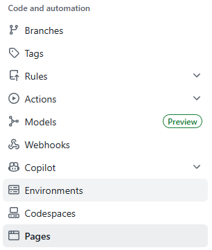
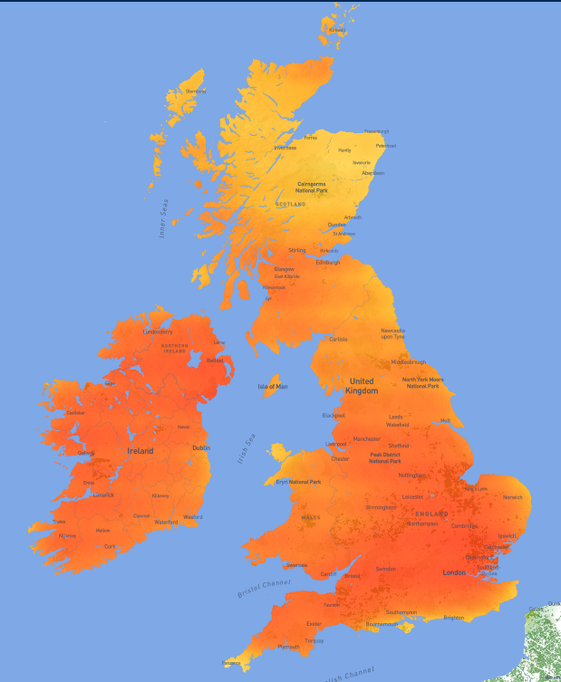

# Table of Contents

1. [Elanco Parasite Risk Map](#elanco-parasite-risk-map)
2. [Deployment](#deployment)
3. [Project Description](#project-description)
4. [Tech Stack](#tech-stack)
   1. [API's And Required Extras](#apis-and-required-extras)
5. [How Score is Determined](#how-score-is-determined)

# Elanco Parasite Risk Map

    An HTML Webpage to display and track the parasite risk in cattle within the UK.

[Our Deployed Page](https://pelwis01.github.io/Elanco_Project/Index.html)

## Deployment

We personally used GitHub Pages.

On every push/merge to the main branch the new version of the page is automatically deployed using GitHub pages.

This hosts the files for the webpage at a publicly accessible URL.

Manual Deployment can also be done through:

    Going to the settings tab of your Repo, then clicking pages.

    
    You then select deploy from branch, choose your desired branch and then publish site.

    !NOTE the repo needs to be public to host on GitHub pages unless you have a GitHub Enterprise subscription which allows for private hosting.
    
    Otherwise, if you would like to host it privately you would need to use your own hosting services.

## Project Description

Our client challenged us to create a interactive map, which should be easy to interpret and understandable for farmers.

Doing this we implemented a Heatmap that shows a clear colour gradient and easy to read key value. The heatmap works by displaying the calculated risk score and overlaying it on top of the UK based on longitude/Latitude points.

## Tech Stack 

Our chosen tech stack for this project is:

    HTML
    JavaScript
    CSS

We focused on using a bareboned approach when it came to tech stack to allow for easier deployment on GitHub Pages.

### API's And Required Extras 

---

Although basic tech stack was used, we also used multiple libraries to help provide data as well as gather the data in real time.

These are:

    Leaflet.js (v1.9.4) + CSS
        Additional Plugins:
        - Leaflet Geosearch + CSS (v3.0.0)
        - Leaflet Heatmap + CSS
    Plotly

    OpenMeteo Weather Forecast API (v1)
    OpenMeteo Elevation API (v1)
    MapBox API (API Key Required)

We have also created a file with UK Lat Lon values to iterate through to allow for easier Mapping.

## How Score is Determined

   Temp in °C, rainfall in mm, soilMoisture in % (0–100) for 3–9cm depth, Altitude in meters (m)
   Returns risk scores (0–100) for various parasites, where higher scores indicate higher risk 
   Each parasite has unique thresholds and weightings based on its biology 
   Rainfall multiplier varies depending on the parasite's moisture dependency

   **Gutworm**
    risk = (tempScore * 0.45) +
			   (rainScore * 0.25) +
			   (soilScore * 0.2) +
			   (altScore * 0.1);

   **Lungworm**
   risk = (tempScore * 0.35) +
			   (rainScore * 0.3) +
			   (soilScore * 0.2) +
			   (altScore * 0.15);

   **Liver Fluke**
   risk = (tempScore * 0.15) +
			   (rainScore * 0.4) +
			   (soilScore * 0.25) +
			   (altScore * 0.2); // strong altitude effect

   **Hairworm**
   risk = (tempScore * 0.55) +
			   (rainScore * 0.2) +
			   (soilScore * 0.15) +
			   (altScore * 0.1);
            
   **Coccidia**
   risk = (tempScore * 0.35) +
			   (rainScore * 0.25) +
			   (soilScore * 0.25) +
			   (altScore * 0.15);

   **Tick**
   risk = (tempScore * 0.3) +
			   (rainScore * 0.2) +
			   (soilScore * 0.35) +
			   (altScore * 0.15);
